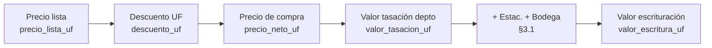

# Variables y cálculos — Cotizador Brekto

Referencia para **auditoría y futura librería** (p. ej. API en v2). El código debe seguir este documento; la UI solo muestra etiquetas para el asesor.

**Alcance de esta revisión:** pestaña **Cotización** (una unidad = `Cotizacion`). Módulos **Flujo / IVA / diversificación** se resumen en §4; no forman parte del detalle de cotización unitaria.

**Motor principal:** `calcularResultadosCotizacion(cot, uf_valor_clp)` → `ResultadosCotizacion`.

**Documento hermano (alcance Resumen de inversión):** `CONTEXTO_RETOMAR_RESUMEN_INVERSION.md` — las **definiciones fijas** de negocio para esa pestaña deben coincidir con **§1.0** de este archivo; cualquier cambio de fórmula se anota aquí primero.

### Prioridad: motor de cálculo vs capa de datos (Supabase)

- **Fuente de verdad del negocio** es el contrato de código: `Cotizacion` / `ResultadosCotizacion` en `src/types/index.ts`, las funciones en `src/lib/engines/*`, los tests y **este documento**. Ahí deben estar **definidas y auditables** las variables de cálculo y las fórmulas.
- **La base de datos conectada hoy vía Supabase no es la definitiva.** Solo sirve para **validar el flujo de carga y los cálculos** con datos reales de **una inmobiliaria y un proyecto**. El esquema definitivo contemplará un ecosistema mucho mayor (orden de magnitud: **~30 inmobiliarias**, **~260 proyectos**, **>10.000 unidades** de stock), con tablas dinámicas y columnas que **aún no existen** en el esquema provisional.
- **Habrá un remapeo explícito** entre columnas de la BD definitiva y campos como `DatosPropiedad` cuando esa capa esté lista. Hasta entonces, el mapeo actual (`Stock_Imagina_Prueba` → fila → `UnidadSupabase` / `DatosPropiedad` en `useSupabase.ts`) es **temporal y deliberadamente acotado**: no debe arrastrar nombres de columnas legacy al motor ni a este documento más allá de la tabla de § «Desde API».
- **Implicación para el equipo:** invertir en **claridad de variables y funciones de cálculo** tiene más valor que pulir el mapeo Supabase actual; el segundo se reemplazará al cerrar el modelo de datos de producción.

Archivos de implementación:

| Archivo | Rol |
|---------|-----|
| `src/lib/engines/calculosCotizacion.ts` | Tasación, escritura, pie total, hipotecario, plusvalía, arriendo |
| `src/lib/engines/calculosPie.ts` | Desglose del pie en CLP (upfront, cuotas, cuotón) |
| `src/lib/engines/validarCalculosCotizacion.ts` | Comprobaciones de coherencia motor vs fórmulas (§8) |
| `src/types/index.ts` | Contrato TypeScript `Cotizacion` / `ResultadosCotizacion` |

**Validar cálculos**

1. `pnpm test` — cubre fórmulas §3.1–3.5, hipotecario, pie CLP, IVA/flujo básico, y casos de error (pie+LTV ≠ 100%, lista≠neto).
2. `validarResultadosCotizacion(cot, res)` en `src/lib/engines/validarCalculosCotizacion.ts` — recomputa §3.1 y cruza pie/crédito/amortización; devuelve `{ ok, fallos[] }` para tests o API futura.
3. `recomputarValorEscrituraUf` / `recomputarValorTasacionUf` — mismas fórmulas que el motor, para auditoría manual o hoja Excel.

---

## Cotización — origen de datos

Objetivo v2: la **librería** recibe un JSON alineado con `Cotizacion`; la web rellena ese objeto desde API + formulario.

### Desde API (Supabase u otro backend)

**Estado:** mapeo **provisional** solo para validar cálculos; la BD de producción será otra (ver «Prioridad: motor de cálculo vs capa de datos» arriba).

Hoy el ejemplo vive en `useSupabase.ts` → tabla **`Stock_Imagina_Prueba`** (esquema de prueba) → `UnidadSupabase`. Al cargar una unidad se mapea a `DatosPropiedad` (y defaults). Los nombres de columna de esta tabla **no** pretenden ser el contrato largo plazo.

| Columna / origen actual (ejemplo) | Campo en `DatosPropiedad` | Notas |
|-----------------------------------|---------------------------|--------|
| `precio` | `precio_lista_uf` | |
| `precio_dcto` | `precio_neto_uf` | |
| derivado | `descuento_uf` | `precio_lista_uf - precio_neto_uf` |
| `dcto` | `bono_descuento_pct` | **Contrato lógico:** decimal (ej. `0.15`); validar que la BD definitiva use el mismo criterio |
| `bono10` | `bono_max_pct` | **Descuento por Bonificación (%)** en UI; en escritura solo afecta estac.+bodega si `bono_aplica_adicionales` (ver §3.1) |
| (fijo hoy) | `bono_aplica_adicionales` | Cuando la API definitiva lo exponga, mapear aquí |
| superficies, modelo, etc. | campos `unidad_*` | |
| (no en fila actual) | `estacionamiento_uf`, `bodega_uf` | Rellenar desde API cuando existan |

Metadatos de proyecto (`proyecto_nombre`, comuna, barrio, dirección) vienen hoy de un **proyecto sintético** en código; en producción vendrán del recurso proyecto/inmobiliaria asociado a la unidad.

**Pendiente (BD / API definitiva):** fijar nombres de tablas y columnas, tipos (decimal vs entero para %), relaciones inmobiliaria → proyecto → unidad, y **reemplazar esta tabla** por un único documento de mapeo BD → `DatosPropiedad`.

**Implementación en código:** capa `src/lib/stock/` — interfaz `StockRepository`, repositorio actual (`imaginaPruebaRepository.ts`), fábrica `createDefaultStockRepository`, mapeo `unidadSupabaseToDatosPropiedad` y validación previa al motor `validateUnidadSupabaseForMotor`. Las **reglas de cálculo** siguen predeterminadas en `src/lib/engines/*`; solo cambian si negocio lo exige y se actualiza el doc + tests.

### Rellenados en sesión (manual en formulario)

No dependen de la fila de stock (o se sobreescriben):

- **`DatosDesglosePie`** — toda la sección pie: `pie_pct`, `upfront_pct`, cuotas antes/después, cuotón, `pie_n_cuotas_total`, etc.
- **`DatosHipotecario`** — tasa, plazo, % aprobación, seguros, etc.
- **`DatosRentabilidad`** — plusvalía, arriendo / AirBnB (la misma pestaña Cotización los expone; alimentan resultados pero no el “detalle precio” desde BD).
- **`uf_valor_clp`** en `DatosGlobales` — puede venir de API UF del día o ingreso manual.
- **`reserva_clp`** — hoy en `DatosPropiedad`; puede quedar como dato de operación comercial.

---

## 1) Variables de entrada (`Cotizacion`)

Los **identificadores** son el contrato código/API. Las **etiquetas** en pantalla pueden diferir (tabla siguiente).

### 1.0 Definiciones fijas — negocio vs código (documento maestro)

Estas definiciones están **fijadas** para alinear la comparativa del **Resumen de inversión** con el motor (`calculosCotizacion.ts`, `calculosPie.ts`, `validarCalculosCotizacion.ts`). **No cambiar el significado** sin actualizar este apartado y los tests asociados.

#### 1.0.0 Diferenciación clave: lista, precio de compra, valor tasación, valor escrituración

Son **cuatro magnitudes distintas**. Mezclarlas en etiquetas o en celdas (Cotización, Simulador, **Resumen**, Flujo) produce errores de interpretación y de fórmula. En el código, cada una tiene un rol preciso en la cadena de cálculo.

##### Qué es cada una (orden lógico)

| Magnitud | Qué representa (negocio) | Variable en código | Cómo se obtiene |
|----------|--------------------------|--------------------|-----------------|
| **1. Precio lista** | Valor de catálogo / lista del **departamento** antes de los descuentos comerciales que el asesor aplica en la negociación. Es el punto de partida del “descuento UF”. | `precio_lista_uf` | Entrada: stock/API o manual. |
| **2. Precio de compra** | Monto **neto comercial** que el cliente pagaría por **cada rubro** (depto, estacionamiento, bodega) **después** de aplicar **todos** los descuentos sobre lista que correspondan a ese rubro. **No** incluye el beneficio inmobiliario (BI / “bono pie” hacia tasación) ni pasos posteriores del motor. **Ejemplo planilla de referencia:** con solo depto, “Precio depto con dctos” = 2.881,33 UF; con Est.=0 y Bod.=0, “Precio de compra [UF]” = 2.881,33 UF. | En código: neto **depto** `precio_neto_uf` (invariante `precio_lista_uf − descuento_uf`); adicionales `estacionamiento_uf`, `bodega_uf` deben cargarse **ya netos** post-descuentos propios. **Precio de compra total (referencia):** `precio_neto_uf + estacionamiento_uf + bodega_uf`. | Si varios % en cadena en Excel ya están **incorporados** en `precio_neto_uf`, configurar `bono_max_pct` / `bono_descuento_pct` para **no duplicar** (§1 “Mapeo cotizador secuencial”). |
| **3. Valor tasación** (depto) | Valor del depto **tal como lo usa el esquema de financiamiento / tasación**: **solo después** de cerrado el precio de compra del depto se aplica la lógica de §3.1 (**beneficio inmobiliario** `bono_descuento_pct` y **Descuento por Bonificación** `bono_max_pct`). En el ejemplo de referencia, “Precio con Bono Pie” del depto = 2.881,33 ÷ (1 − 0,15) = **3.389,80 UF**. | `valor_tasacion_uf` | **Solo depto:** `valorTasacionDeptoUf(precio_neto_uf, bono_descuento_pct, bono_max_pct)`. No incluye estacionamiento ni bodega. |
| **4. Valor (precio) de escrituración** | **Base total de la operación en escritura:** valor tasación del depto **más** estacionamiento y bodega expresados en UF, según reglas de §3.1 (si `bono_aplica_adicionales`, los adicionales pueden repercutir el beneficio inmobiliario). Sobre este valor se calculan **pie %**, **crédito**, **plusvalía base**, **IVA** en flujo, etc. | `valor_escritura_uf` | `valor_tasacion_uf + adicionales_en_escritura_uf` (ver §3.1). |

##### Orden obligatorio (descuentos → compra → BI / tasación)

1. **Primero:** aplicar **todos** los descuentos comerciales (sobre lista) a depto y, si corresponde, a estacionamiento y bodega → queda definido el **precio de compra** por componente.  
2. **Después y solo después:** aplicar el **beneficio inmobiliario %** (y en el motor el **Descuento por Bonificación %** si no va ya absorbido en el neto) para obtener **valor tasación** del depto y, con adicionales según §3.1, **valor escrituración**.  
3. El **crédito %** (p. ej. 80 %) se calcula sobre la **base post-BI** (p. ej. “Precio con Bono Pie” / `valor_escritura_uf` según caso), no sobre el precio de compra neto comercial.

##### Cadena visual (solo depto → luego adicionales)

Sobre el **depto**, la transición **precio de compra → valor tasación** no es otro “descuento de lista”: es la **repercusión del BI** (y regla de `bono_max_pct` en §3.1) **sobre el precio de compra ya cerrado**. En el ejemplo numérico citado arriba, ese paso es equivalente a **precio de compra depto ÷ (1 − beneficio inmobiliario)** cuando solo aplica el BI y el Descuento por Bonificación ya está absorbido en el neto (`bono_max_pct = 0` en el motor).

##### Relación con otros resultados (para no confundir celdas)

| Resultado | Relación |
|-----------|----------|
| `beneficio_inmobiliario_uf` | Monto asociado al **beneficio inmobiliario %** sobre la **tasación del depto:** `valor_tasacion_uf × bono_descuento_pct`. No es el “precio de compra”; es parte del esquema que separa neto comercial de valor tasación. |
| `precio_compra_total_uf` (derivado, §1.0.1) | Si se muestra **una** fila “compra total” con depto + adicionales a precio de compra: típicamente `precio_neto_uf + estacionamiento_uf + bodega_uf` **solo si** estac./bodega están al mismo criterio de “precio pagado” que el depto. El motor sigue usando `valor_escritura_uf` para pie y crédito. |

##### Impacto por pestaña (lectura obligatoria para UI)

| Pestaña | Qué debe mostrar / usar |
|---------|-------------------------|
| **Cotización** | **Lista**, **descuento**, **precio de compra** (`precio_neto_uf`); resultados **valor tasación** y **valor escrituración** como solo lectura. Etiquetas claras: no llamar “precio neto” a lo mismo que “valor tasación”. |
| **Simulador (hipotecario)** | Crédito y dividendos sobre **`valor_escritura_uf`** (y LTV), no sobre precio lista ni solo precio de compra del depto. |
| **Resumen de inversión** | Comparativa: columna de **precio de compra** = criterio comercial (`precio_neto_uf` y/o total según §1.0.1); montos de **pie** y **crédito** referidos a **`valor_escritura_uf`**. No mezclar “precio de compra” con “valor escrituración” en la misma celda sin etiqueta explícita. |
| **Flujo / IVA** | IVA y bases de flujo que dependen del valor de la operación en escritura usan criterios definidos en §4 (p. ej. `valor_escritura_uf` donde aplique). |

#### 1.0.1 Nombres comerciales (Resumen) ↔ variables

| Nombre comercial (fijo) | Significado de negocio | Variable(es) en código | Notas / fórmula |
|-------------------------|------------------------|-------------------------|-----------------|
| **PRECIO DE COMPRA** | **Lista menos todos los descuentos comerciales** aplicables a depto, estacionamiento y bodega (según operación). Es la **base comercial final antes del BI**; **no** incluye beneficio inmobiliario ni “precio con bono pie”. | **Depto:** `propiedad.precio_neto_uf`. **Adicionales:** `propiedad.estacionamiento_uf`, `propiedad.bodega_uf` (cada uno al precio de compra de ese ítem). **Total referencia:** `precio_neto_uf + estacionamiento_uf + bodega_uf`. | **No** es `valor_tasacion_uf` ni `valor_escritura_uf`. El **BI** se aplica **después**, sobre esa lógica (ver §1.0.0 “Orden obligatorio” y §3.1). |
| **Precio neto (etiqueta histórica en UI)** | En pantalla y tablas antiguas suele mostrarse el neto del **depto** únicamente. | `propiedad.precio_neto_uf` | Sustitución de etiqueta hacia **PRECIO DE COMPRA** según fila mostrada (solo depto vs total con adicionales) — ver `CONTEXTO_RETOMAR_RESUMEN_INVERSION.md`. |
| **Pie a documentar** | Porcentaje y monto del pie sobre **valor de escrituración**. | `pie.pie_pct`; resultado: `pie_total_uf` = `valor_escritura_uf × pie_pct` | `calcularResultadosCotizacion` |
| **Bono pie** | Parte del pie que la inmobiliaria **bonifica** (no la cuota de caja del cliente por ese tramo). En el formulario es el **resto** del `pie_pct` respecto de upfront + cuotas antes/después + cuotón (todos como % sobre **valor escrituración** en la planilla de referencia). | En UF: conceptualmente `bono_pie_uf = valor_escritura_uf × pct_bonificacion_pie`, con `pct_bonificacion_pie = pie_pct − upfront_pct − cuotas_antes_entrega_pct − cuotas_despues_entrega_pct − cuoton_pct` (coherente con `CotizacionForm.tsx`). | Hasta que exista campo dedicado en `DatosDesglosePie`, el valor se **deriva** de los % anteriores. No confundir con `beneficio_inmobiliario_uf` (beneficio sobre **tasación** del depto, `bono_descuento_pct`). |
| **PIE A PAGAR** | Efectivo / obligación de pie que efectivamente asume el cliente frente al pie documentado y la bonificación de pie. | **Definición acordada:** `pie_a_pagar_uf = pie_total_uf − bono_pie_uf` (mismos símbolos que arriba). | Debe mostrarse en comparativa cuando **Bono pie** esté explícito. |

#### 1.0.2 Qué NO es “precio de compra” (para no mezclar celdas)

| Variable / resultado | Por qué no es “precio de compra” |
|----------------------|----------------------------------|
| `valor_tasacion_uf` | Incluye repercusión del **beneficio inmobiliario** (`bono_descuento_pct`) sobre el neto del depto: es base “banco / tasación”, no el desembolso comercial “neto lista”. |
| `valor_escritura_uf` | Tasación depto + adicionales según §3.1; sigue sin ser el “precio de compra” del cuadro comercial si la definición excluye explícitamente mecanismos tipo bono pie sobre tasación. |
| `beneficio_inmobiliario_uf` | Es `valor_tasacion_uf × bono_descuento_pct` (beneficio sobre tasación), **no** el “bono pie” del desglose de pie en cuotas. |

#### 1.0.3 Mapa función ↔ variables (cotización)

| Función | Archivo | Entradas relevantes (`Cotizacion` / globales) | Salidas usadas en comparativa / resumen |
|---------|---------|-----------------------------------------------|----------------------------------------|
| `calcularResultadosCotizacion` | `calculosCotizacion.ts` | `propiedad.precio_neto_uf`, `bono_descuento_pct`, `bono_max_pct`, `estacionamiento_uf`, `bodega_uf`, `bono_aplica_adicionales`, `pie.pie_pct`, `hipotecario.*`, `rentabilidad.*`, `uf_valor_clp` | `valor_tasacion_uf`, `valor_escritura_uf`, `beneficio_inmobiliario_uf`, `pie_total_uf`, `pie_total_clp`, `hipotecario.monto_credito_*`, `hipotecario.dividendo_*`, `plusvalia.*`, `arriendo.*` |
| `valorTasacionDeptoUf` | `calculosCotizacion.ts` | `precio_neto_uf`, `bono_descuento_pct`, `bono_max_pct` | `valor_tasacion_uf` (paso intermedio de escritura) |
| `calcularMontosDesglosePieClp` | `calculosPie.ts` | `valor_escritura_uf` (base CLP), `pie.*`, `uf_valor_clp` | Montos upfront / cuotas / cuotón en CLP (desglose de caja del pie; ver §9 si la base debe ser solo escritura CLP) |
| `calcularHipotecario` | `calculosCotizacion.ts` | `valor_escritura_uf`, `hipotecario.*`, `uf_valor_clp` | `monto_credito_uf`, `dividendo_*`, tabla amortización |
| `calcularPlusvalia` | `calculosCotizacion.ts` | `valor_escritura_uf`, `pie_total_uf`, `plusvalia_anual_pct`, `plusvalia_anos` | Proyección venta / utilidad |
| `calcularArriendo` | `calculosCotizacion.ts` | `rentabilidad.*`, dividendo, `valor_escritura_uf`, `uf_valor_clp` | Cap rates, flujo vs dividendo |
| `validarResultadosCotizacion` | `validarCalculosCotizacion.ts` | `cot`, `res` | Auditoría coherencia §3.1–3.2 vs motor |
| `recomputarValorTasacionUf` / `recomputarValorEscrituraUf` | `validarCalculosCotizacion.ts` | `propiedad` | Misma geometría que el motor para tests |

**Valores derivados para la comparativa (no son campos guardados hasta nueva versión de tipos):**

- `precio_compra_total_uf` = `precio_neto_uf + estacionamiento_uf + bodega_uf` (definición de referencia; validar negocio).
- `bono_pie_uf` = `valor_escritura_uf × (pie_pct − upfront_pct − cuotas_antes_entrega_pct − cuotas_despues_entrega_pct − cuoton_pct)` con los % del desglose alineados a la planilla.
- `pie_a_pagar_uf` = `pie_total_uf − bono_pie_uf`.

### Etiquetas UI ↔ variable (pestaña Cotización)

| Etiqueta (asesor) | Variable |
|-------------------|----------|
| Beneficio inmobiliario (%) | `bono_descuento_pct` |
| Descuento por Bonificación (%) | `bono_max_pct` |
| Bono adicionales | `bono_aplica_adicionales` |
| PIE a documentar (%) | `pie.pie_pct` |
| Upfront, % antes/después, cuotón, N° cuotas… | campos en `pie` (ver lista) |
| Tasa, plazo, financiamiento, seguros | campos en `hipotecario` (ver lista) |
| Valor tasación (UF) (solo lectura) | `valor_tasacion_uf` (resultado) |
| Valor escrituración (UF) (solo lectura) | `valor_escritura_uf` (resultado) |
| Resumen «Bono descuento (UF)» en PDF/simulador | `beneficio_inmobiliario_uf` (resultado) |

### Mapeo cotizador secuencial (referencia comercial)

En planillas con **varios % de descuento en cadena** sobre el precio lista y luego una **bonificación %** hacia escrituración:

| Paso en cotizador depurado | Equivalente en esta app |
|----------------------------|-------------------------|
| 1.er descuento (% s/ lista) | **Dcto. (% s/ lista)** + **Dcto. (UF)** (y coherencia con **Precio neto**). Varios pasos secuenciales deben **reflejarse en el precio neto** cargado (manual o derivado). |
| 2.do descuento | Hoy no hay campo propio; puede integrarse en el neto o en el primer dcto. |
| 3.er descuento (% s/ precio ya rebajado) | **Descuento por Bonificación (%)** (`bono_max_pct`) **solo si** ese % debe aplicarse **en el motor** además del neto. Si el neto **ya incluye** ese paso (como en la landing «Precio con descuento»), dejar **Descuento por Bonificación % = 0** para no duplicar. |
| Bonificación % (→ valor escrituración) | **Beneficio inmobiliario (%)** (`bono_descuento_pct`). Con neto ya final y sin `bono_max` extra: tasación/escritura depto siguen `precio_neto ÷ (1 − beneficio)` (caso típico bonificación pura). |

### `DatosPropiedad` (antecedentes + detalle precio)

- Identificación: `proyecto_*`, `unidad_*` (número, tipología, superficies, orientación, entrega).
- Precio: `precio_lista_uf`, `descuento_uf`, `precio_neto_uf` con invariante `precio_neto_uf = precio_lista_uf - descuento_uf`.
- Tasación / escritura (inputs): `bono_descuento_pct`, `bono_max_pct`, `bono_aplica_adicionales`, `estacionamiento_uf`, `bodega_uf`.
- Operación: `reserva_clp`.

### `DatosDesglosePie`

- `pie_pct` — pie documentado sobre `valor_escritura_uf` → `pie_total_uf = valor_escritura_uf × pie_pct`.
- `upfront_pct`, `cuotas_antes_entrega_pct`, `cuotas_antes_entrega_n`, `cuotas_despues_entrega_pct`, `cuotas_despues_entrega_n`, `cuoton_pct`, `cuoton_n_cuotas` — cada `%` del desglose se aplica sobre **`valor_escritura_uf`** (no sobre `pie_total_uf`); los montos en $ del resumen pie usan esa base.
- `pie_n_cuotas_total` — usado en **diversificación / flujo 60 meses** (`calculosDiversificacion.ts`) para repartir el pie en cuota mensual equivalente; **no** entra al cálculo de upfront / cuota antes / después / cuotón en `calculosPie.ts`.

No hay validación automática de que la suma de % de desglose coincida con `pie_pct`.

### `DatosHipotecario`

- `hipotecario_tasa_anual`, `hipotecario_plazo_anos`, `hipotecario_aprobacion_pct` (LTV).
- `hipotecario_seg_desgravamen_uf`, `hipotecario_seg_sismos_uf`, `hipotecario_tasa_seg_vida_pct`.

### `DatosRentabilidad`

Usado por el mismo `calcularResultadosCotizacion` para `plusvalia` y `arriendo` (§3.4–3.5). Lista completa en `types/index.ts`.

### Regla pie + crédito

`pie_pct + hipotecario_aprobacion_pct` debe ser `≈ 1`. Si no, el motor solo emite `console.warn`; conviene validar en API v2.

### Diversificación (fuera del detalle cotización)

Variables globales del módulo 60 meses: `diversif_*`, `mes_entrega_primer_depto`, etc. Ver §4.

---

## 2) Salida del motor (`ResultadosCotizacion`)

Todo sale de `calcularResultadosCotizacion`. Campos raíz:

| Campo | Significado |
|-------|-------------|
| `precio_compra_total_uf` | Entrada comercial agregada: `precio_neto_uf + estacionamiento_uf + bodega_uf` (post-descuentos, pre-BI). Ver `precioCompraTotalUf`. |
| `valor_tasacion_uf` | Depto: fórmula §3.1 sobre `precio_neto_uf` (beneficio inmob. y `bono_max_pct`). |
| `valor_escritura_uf` | Base banco: `valor_tasacion_uf` + adicionales (§3.1). |
| `beneficio_inmobiliario_uf` | `valor_tasacion_uf * bono_descuento_pct` |
| `pie_total_uf` / `pie_total_clp` | Pie documentado sobre `valor_escritura_uf` |
| `hipotecario` | `monto_credito_*`, `dividendo_*`, `tabla_amortizacion` |
| `plusvalia` | Proyección venta (§3.4) |
| `arriendo` | Flujo vs dividendo (§3.5) |

Para **solo** precio/pie/crédito en un microservicio futuro, el subconjunto mínimo suele ser: `valor_*`, `beneficio_inmobiliario_uf`, `pie_total_*`, `hipotecario.monto_credito_*`, `hipotecario.dividendo_*` (sin obligar plusvalía/arriendo).

---

## 3) Formulas implementadas (vigentes)

## 3.1 Base propiedad / escrituracion

Tomando:

- `precio_neto_uf = propiedad.precio_neto_uf`
- `b_desc = bono_descuento_pct`
- `b_max = bono_max_pct`
- `adicionales_uf = estacionamiento_uf + bodega_uf`

Se calcula:

1. **Tasación depto (`valor_tasacion_uf`)** — fórmula única:  
   `valor_tasacion_uf = precio_neto_uf × (1 - b_max) / (1 - b_desc)`  
   - Solo **Descuento por Bonificación** (`b_max`, con `b_desc = 0`): **multiplica** el neto: `× (1 - b_max)` (no dividir).  
   - Solo beneficio inmobiliario (`b_max = 0`): **divide** el neto: `÷ (1 - b_desc)`.  
   - Si `(1 - b_desc) ≤ 0`, fallback `precio_neto_uf`.

2. **Adicionales en escritura (UF)** — por ítem, luego suma:  
   - Si `bono_aplica_adicionales = false`: `estacionamiento_uf + bodega_uf`.  
   - Si `bono_aplica_adicionales = true` y `(1 - b_desc) > 0`:  
     `estacionamiento_uf / (1 - b_desc) + bodega_uf / (1 - b_desc)`  
     (repercusión del beneficio inmobiliario sobre cada adicional).  
   - Si divisor ≤ 0: usar suma bruta `estacionamiento_uf + bodega_uf`.

3. `valor_escritura_uf = valor_tasacion_uf + adicionales_en_escritura_uf`.

4. `valor_escritura_uf` — único campo de escrituración en resultados (se eliminó el alias duplicado `escrituracion_uf` del código).

5. `beneficio_inmobiliario_uf = valor_tasacion_uf * b_desc`.

## 3.2 Pie

1. `pie_total_uf = valor_escritura_uf * pie_pct`
2. `pie_total_clp = pie_total_uf * uf_valor_clp`

Desglose en pesos (upfront, cuotas antes/después, cuotón): `calcularMontosDesglosePieClp` en `calculosPie.ts` aplica cada `*_pct` sobre **`valor_escritura_uf`** (equivalente a base CLP = valor escrituración × UF), y los tramos en cuotas dividen por `max(N, 1)`.

## 3.3 Hipotecario (sistema frances)

Base:

1. `monto_credito_uf = valor_escritura_uf * hipotecario_aprobacion_pct`
2. `monto_credito_clp = monto_credito_uf * uf_valor_clp`
3. `n_meses = hipotecario_plazo_anos * 12`
4. `tasa_mensual = hipotecario_tasa_anual / 12`
5. `cuota_capital_uf`: si `tasa_mensual > 0`, PMT francés `monto * (r / (1 - (1+r)^-n))`; si `tasa_mensual = 0`, `monto / n_meses`. Si `n_meses <= 0` o `monto_credito_uf <= 0`, tabla vacía y solo seguros mínimos.

Iteracion mensual (`mes = 1..n_meses`):

- `interes_uf = round2(saldo * tasa_mensual)`
- `capital_uf = ultimo_mes ? saldo : round2(cuota_capital_uf - interes_uf)`
- `seg_vida_uf = max(round2(saldo * tasa_seg_vida * UF), 0.01 * UF) / UF`
- `cuota_total_uf = capital_uf + interes_uf + seg_desgravamen_uf + seg_vida_uf + seg_sismos_uf`
- `saldo = round2(saldo - capital_uf)`
- `cuota_total_clp = round0(cuota_total_uf * UF)`

Salida principal:

- `dividendo_total_uf = cuota_total_uf` del mes 1
- `dividendo_total_clp = round0(dividendo_total_uf * UF)`

## 3.4 Plusvalia

Se usa `valor_escritura_uf` como base:

1. `precio_venta_5anos_uf = valor_escritura_uf * (1 + plusvalia_anual_pct)^(plusvalia_anos)`
2. `ganancia_venta_uf = precio_venta_5anos_uf - valor_escritura_uf + pie_total_uf`
3. `ganancia_venta_clp = ganancia_venta_uf * uf_valor_clp`
4. `utilidad_pct = (ganancia_venta_uf - pie_total_uf) / pie_total_uf` (si `pie_total_uf > 0`) — en código, `ganancia_venta_uf` aquí es el valor **antes** de `round2` en el objeto retornado; el campo `ganancia_venta_uf` expuesto sí va redondeado.

## 3.5 Arriendo

1. `dividendo_clp = round0(dividendo_total_uf * uf_valor_clp)`
2. `ingreso_neto_clp =`
   - renta corta: `airbnb_bruto - round0(airbnb_bruto * airbnb_admin_pct) - gastos_comunes`
   - renta larga: `arriendo_mensual_clp`
3. `resultado_mensual_clp = ingreso_neto_clp - dividendo_clp`
4. `ingreso_uf = ingreso_neto_clp / uf_valor_clp`
5. `cap_rate_anual_pct = (ingreso_uf * 12) / valor_escritura_uf`
6. `ingreso_neto_flujo_clp = ingreso_neto_clp`

---

## 4) IVA y flujo 60 meses

Pestaña **Flujo** y lógica asociada; consume `ResultadosCotizacion` de cada cotización activa. No amplía las variables de entrada de la cotización unitaria más allá de `califica_iva` en `Cotizacion`.

## 4.1 IVA automatico

En `calcularIvaTotal`:

- se consideran cotizaciones `activa && califica_iva`
- por cada una: `iva_unidad = valor_escritura_uf * 0.15 * uf_valor_clp`
- `iva_total = sum(iva_unidad)`

## 4.2 Diversificacion

Precalculos:

1. `iva_total = diversif_iva_manual_override ? diversif_iva_total_clp : calcularIvaTotal(...)`
2. `mes_iva = mes_entrega_primer_depto + 5`
3. `cuota_pie_total = sum(pie_total_clp / (pie_n_cuotas_total || 60))`
4. `diferencia_dividendo_arriendo = sum(dividendo_total_clp - ingreso_neto_flujo_clp)`

Iteracion (`mes = 1..60`):

- `egreso = mes < mes_entrega ? cuota_pie_total : max(diferencia_dividendo_arriendo, 0)`
- `iva_este_mes = mes === mes_iva ? iva_total : 0`
- `capital_inicio = capital_anterior + ahorro_mensual - egreso + iva_este_mes`
- `rentabilizacion = round0(capital_inicio * diversif_tasa_mensual)`
- `capital_fin = capital_inicio + rentabilizacion`
- `ganancia_acumulada = round0(capital_fin - capital_inicial)`

---

## 5) Mapa de funciones (libreria actual)

- `calcularResultadosCotizacion(cot, uf_valor_clp)`
- `calcularMontosDesglosePieClp(pie_total_uf, pie, uf_valor_clp)`
- `validarResultadosCotizacion(cot, res)` — validación cruzada motor vs fórmulas
- `calcularHipotecario(valor_escritura_uf, hip, uf_valor_clp)`
- `calcularPlusvalia(valor_escritura_uf, pie_total_uf, plusvalia_anual_pct, plusvalia_anos, uf_valor_clp)`
- `calcularArriendo(rent, dividendo_total_uf, valor_escritura_uf, uf_valor_clp)`
- `calcularIvaTotal(cotizaciones, uf_valor_clp)`
- `calcularDiversificacion(datos, cotizaciones, uf_valor_clp)`
- `calcularProyeccionPatrimonio(cotizaciones, anos)`

---

## 6) Evolución (librería / API v2)

- Exponer **una función pura** `calcularResultadosCotizacion` con entrada/salida JSON estable (mismos nombres que este documento).
- La **web** compone `Cotizacion`: GET unidad + defaults + overrides del formulario.
- Mantener **un solo mapeo** BD definitiva → `DatosPropiedad` en una capa dedicada (reemplazar por completo el ejemplo `Stock_Imagina_Prueba` / `useSupabase.ts` cuando el modelo multi-inmobiliaria y multi-proyecto esté cerrado).

## 7) Pendientes / decisiones

- Confirmar con negocio si `mes_iva = mes_entrega + 5` es definitivo (módulo flujo).
- Validar en API que columnas `%` (p. ej. `dcto`) vengan en el mismo rango que espera `bono_descuento_pct` (0–1 decimal).
- Ajustar tolerancias del depurador si Excel redondea distinto.

---

## 8) Coherencia “100% valor propiedad” (validación)

Implementación: `validarResultadosCotizacion(cot, res)` en `validarCalculosCotizacion.ts` (también cubierto por tests).

Comprueba (tolerancia ~0,02 UF y ~0,05 pt en porcentajes):

1. **Lista − Descuento = Precio neto**  
   `precio_lista_uf - descuento_uf` debe coincidir con `precio_neto_uf` cargado.

2. **Precio neto coherente con tasacion (bono descuento %)**  
   Identidad inversa de `valor_tasacion_uf = precio_neto_uf / (1 - bono_descuento_pct)`:  
   `precio_neto_uf ≈ valor_tasacion_uf * (1 - bono_descuento_pct)`.

3. **PIE a documentar + credito = 100%**  
   `pie_pct + hipotecario_aprobacion_pct = 1`.

4. **Pie UF + Credito UF = Valor escrituracion UF**  
   Consecuencia del punto 3 sobre la misma base:  
   `pie_total_uf + monto_credito_uf ≈ valor_escritura_uf`.

Cuando subas el pantallazo de la planilla, se puede afinar textos o agregar una quinta fila si Excel usa otra celda como "100% valor propiedad".

---

## 9) Revisión vs planilla «SIMULACIÓN FINANCIERA» (Excel)

Referencia: captura abril 2026 (UF = 39.841,72). Fila de ejemplo sin estacionamiento ni bodega.

### Definiciones acordadas (negocio / planilla)

| Concepto | Significado |
|----------|-------------|
| **Valor tasación** | Valor del departamento **con** beneficio inmobiliario (en Excel: «Precio con Bono Pie» / base tasación del depto). En código: `valor_tasacion_uf` cuando solo hay depto; refleja §3.1 (`bono_descuento_pct`, `bono_max_pct` / Descuento por Bonificación). |
| **Valor escrituración** | Tasación del depto tras reglas de escritura (`bono_max`, etc.) **más adicionales** (con o sin el mismo factor según `bono_aplica_adicionales`). En código: `valor_escritura_uf`. **Si no hay adicionales, escrituración = tasación** (en el ejemplo del cuadro son iguales: 3.389,80 UF). |
| **Pie a documentar** | Porcentaje sobre **valor escrituración** → `pie_total_uf = valor_escritura_uf * pie_pct` (**esto el motor ya lo hace bien**). |

### Qué hace bien el cotizador (motor principal)

- `valor_tasacion_uf = precio_neto / (1 - bono_descuento_pct)` alinea con «Precio con Bono» del depto en el ejemplo (~3.389,80 UF a partir de neto 2.881,33 y 15 %).
- `valor_escritura_uf`, `pie_total_uf`, `monto_credito_uf`, pie % + LTV = 100 % sobre la misma base de escrituración.
- Coherencia **Pie UF + Crédito UF = Valor escrituración** cuando los % suman 100 %.

### Error principal: CUADRO DE PAGO PIE (montos en pesos)

En la planilla, los porcentajes del bloque **Upfront**, **Cuotón**, **% antes/después de entrega** (y el tramo asociado a «% pie cuotas») se calculan sobre el **valor de escrituración en pesos** (`valor_escritura_uf × UF`), **no** sobre el monto del pie documentado (`pie_total_uf × UF`).

Comprobación numérica (ejemplo Excel):

| Concepto | Fórmula planilla | Resultado ~ |
|----------|------------------|---------------|
| Base CLP escrituración | 3.389,80 × 39.841,72 | ~135.055.461 CLP |
| Upfront 2 % | 2 % × base escrituración CLP | **~2.701.109** (coincide con Excel) |
| Cuotón 1 % | 1 % × base escrituración CLP | **~1.350.555** |
| Cuota después 2 % / 48 | (2 % × base escrituración CLP) / 48 | **~56.273** / mes |

**Cálculo actual del cotizador** (`calculosPie.ts`): aplica cada `*_pct` sobre **`pie_total_uf`** (p. ej. 677,96 UF × 2 % × UF ≈ **~540.219 CLP** de upfront), es decir **~5× menor** que el upfront correcto en el ejemplo. Lo mismo afecta cuotón y cuotas antes/después: **todos los montos del resumen financiero de pie en la web quedan mal** salvo que por casualidad `pie_pct` fuera 100 %.

### Listado de errores / desalineaciones (pendiente de corrección en código)

1. **`calculosPie.ts` — base incorrecta**  
   `calcularMontosDesglosePieClp` usa `pie_total_uf` como base de todos los `upfront_pct`, `cuoton_pct`, `cuotas_*_pct`. Debe alinearse con Excel: base = **`valor_escritura_uf * uf_valor_clp`** (o equivalente en UF multiplicando al final). La firma deberá recibir `valor_escritura_uf` (y `uf_valor_clp`), no inferir el desglose solo desde `pie_total_uf`.

2. **`variables_calculo.md` §3.2 (histórico)**  
   Indicaba que el desglose era «cada % del pie total»; eso **reproduce el bug**. La regla correcta es la de esta §9.

3. **`CotizacionForm.tsx`**  
   Los montos mostrados (Monto upfront, cuota antes/después, cuotón en $) provienen de `calcularMontosDesglosePieClp` → **erróneos** frente a la planilla.

4. **`calculosPie.test.ts`**  
   Los tests fijan el comportamiento incorrecto; habrá que reescribirlos con la base escrituración CLP.

5. **`validarResultadosCotizacion`**  
   No audita el desglose pie en CLP; convendrá añadir comprobaciones cuando la fórmula esté corregida.

6. **«PIE A PAGAR» (5 % en el cuadro Excel)**  
   En la captura, 5 % sobre la base de escrituración CLP coincide con ~6.752.773 (componente de caja vs pie documentado 20 %). El cotizador **no modela** aún esa línea explícita; no es el mismo bug que el punto 1, pero falta paridad funcional con el cuadro si se requiere mostrar «PIE A PAGAR» vs «Pie a documentar».

### Qué no se ha re-auditado en esta revisión

- Redondeos peso a peso del **dividendo** (~502.803) frente a `calcularHipotecario` (seguros, vida mínima, etc.).
- Orden exacto de columnas «Precio Lista» vs «Precio con Bono» en todas las filas del Excel (la numeración del ejemplo se tomó de la captura y del coherente 2.881,33 → 3.389,80 con 15 % beneficio).

*Siguiente paso sugerido:* corregir `calculosPie.ts` + llamadas + tests; actualizar §3.2 con la fórmula definitiva en una sola versión (sin duplicar «código actual vs Excel»).
